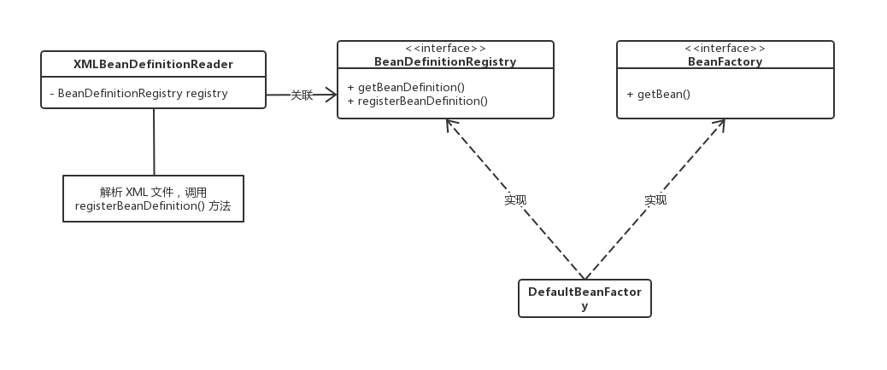

SRP (单一职责原则, Single Responsibility Principle)

- 如果有多于一个的动机去改变一个类，这个类就具有多于一个职责
- 把多个职责耦合在一起，一个的变化可能会削弱或者抑制这个类完成其他职责的能力

SRP 对于一个类而言，应该仅有一个引起它变化的原因。

原先 `DefaultBeanFactory` 具有两个职责：
- 解析 XML 生成 `BeanDefinition` 实例
- 通过反射创建 `Bean` 的实例

改造后的类图如下所示：

